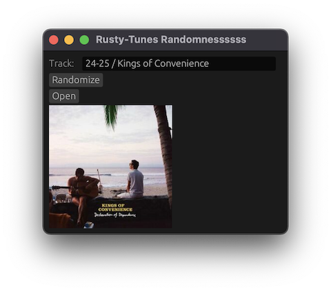

# rusty-tunes

**Basic CLI/GUI Application to navigate through old iTunes xml library with the help of Rust:**


> [!IMPORTANT]
> For now the UI is built with [egui](https://github.com/emilk/egui) framework, but I'm working on a web based wasm compiled version on the [web-frontend](https://github.com/blackccpie/rusty-tunes/tree/feat/web-frontend) branch.

## building

```console
$ cargo build --release
```

## basic use

```
Usage: rusty-tunes <MODE> <PATH>
```

* list all deezer matched tracks (console mode)
```console
$ ./target/release/rusty-tunes T mylibrary.xml
```

* list all playlists (console mode)
```console
$ ./target/release/rusty-tunes P mylibrary.xml
```

* open random tracks (GUI mode)
```console
$ ./target/release/rusty-tunes R mylibrary.xml
```
